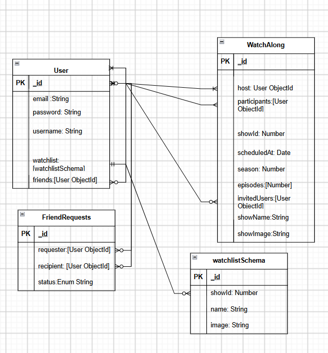

# WatchLog
### Track and Review Your Favourite Shows!

Sign Up, View Shows you watched, Invite friends to watch-a-long

## User Stories
* As a User, i want to have an account i can register and sign up
* As a User, i want to be a able to add other users as friends
* As a User, i want to be able to add friends to watchalongs 
* AS a USer, i want to be able to search shows and create watchalongs with episodes selections
* As a User, i want to be able to add shows to watchlist so i can view later

## Wireframes

### Landing Page

### Home Page

### Your Profile

## Entity Relationship Diagram

## Routes Table
| Method | Path | Purpose|
|--------|------|--------|
| **Auth Routes** |
| GET | `/auth/sign-up` | Register Page |
| POST | `/auth/sign-up` | Create Account |
| GET | `/auth/sign-in` | Login Page |
| POST | `/auth/sign-in` | Login |
| GET | `/auth/sign-out` | Sign Out |
| **Common Pages**|
| GET | `/` | Landing / Home Page |
|**Users**|
| GET | `/users` | Get all Users |
| GET | `/users/search` | Search users |
| GET | `/users/:id` | Get specific User |
| GET | `/users/:id/edit` | Get Profile Edit |
| PUT | `/users/:id` | Update User |
| GET | `/users/:id/watchlist` | Get user's watchlist |
| POST | `/users/:id/watchlist/:showId` | Add show to watchlist |
| DELETE | `/users/:id/watchlist/:showId` | Remove show from watchlist |
| GET | `/users/:id/friends` | Get user's friends |
| DELETE | `/users/:id/friends/:friendId` | Remove friend |
|**Friend Requests**|
| GET | `/requests` | Get all friend requests |
| GET | `/requests/new` | New request page |
| POST | `/requests` | Create request |
| PATCH | `/requests/:id` | Accept/decline request |
| DELETE | `/requests/:id` | Delete request |
|**Watch Along** |
| GET | `/watchalongs` | Get all watchalongs |
| GET | `/watchalongs/invites` | Get watchalong invites |
| GET | `/watchalongs/new/:showId` | Create page |
| GET | `/watchalongs/:id` | Get specific watchalong |
| POST | `/watchalongs` | Create watchalong |
| GET | `/watchalongs/:id/edit` | Edit watchalong page |
| PUT | `/watchalongs/:id` | Update watchalong |
| PATCH | `/watchalongs/:id` | Accept/decline invite |
| PATCH | `/watchalongs/:id/invitedUsers/:userId/add` | Add invited user |
| PATCH | `/watchalongs/:id/invitedUsers/:userId/remove` | Remove invited user |
| PATCH | `/watchalongs/:id/participants/:userId/add` | Add participant |
| PATCH | `/watchalongs/:id/participants/:userId/remove` | Remove participant |
| DELETE | `/watchalongs/:id` | Delete watchalong |
|**Show**|
| GET | `/shows` | Get Shows page |
| GET | `/shows/:id` | Get specific show page |